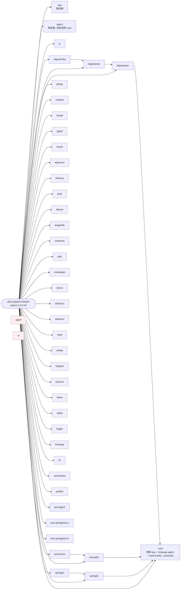

# utils-support-hotspot-parent 架构说明

> 版本：`4.0.0.42`  
> 父 POM：`com.chua:utils-support-hotspot-parent:pom`  
> 子模块数：41（根 `<modules>` 块）  
> 入口 Agent：`com.chua.hotspot.agent.support.Agent`（premain）

---

## 1. 总体分层

```mermaid
graph TB
    subgraph App["目标 JVM 应用"]
        JRE[Java 8/17/21 Runtime]
    end

    subgraph Agent["Agent 薄壳层 (utils-support-hotspot-agent)"]
        PREM[premain: com.chua.hotspot.agent.support.Agent]
        ASM[assembly-plugin 打包成<br/>zero-dep jar]
    end

    subgraph Spy["Spy 桥接层 (utils-support-hotspot-spy)"]
        S1[com.chua.hotspot.spy.Spy]
        S2[com.chua.hotspot.spy.SpyHandler]
        BC[注入 Bootstrap ClassLoader<br/>Instrumentation.appendToBootstrapClassLoaderSearch]
    end

    subgraph Core["核心引擎 (utils-support-hotspot-core)"]
        BB[ByteBuddy 1.14.10 + byte-buddy-agent]
        JC[Javassist 3.29.2-GA]
        HS[HotswapAgent 1.4.1]
        FT[FastMethodHelper 双引擎]
        TSD[追踪/日志/指标数据存储<br/>SQLite + Memory RingBuffer]
        API[Agent HTTP API<br/>/agent/trace /agent/log /agent/hotswap ...]
        SC[WebSocket + RSocket<br/>推送通道]
    end

    subgraph Plugins["插件模块 (按职责拆分, 全部依赖 core)"]
        DB[(DB)<br/>p6spy / mybatis<br/>mysql / pgsql / oracle / sqlserver<br/>hikaricp]
        CACHE[(Cache)<br/>jedis / lettuce / dragonfly]
        WEB[(Web Container)<br/>tomcat9x / tomcat10x / undertow / jetty]
        NET[(Network)<br/>netty / okhttp / httpclient3x/4x/5x]
        SER[(Serialize)<br/>fastjson / jackson]
        MQ[(MQ)<br/>kafka / rabbit]
        RPC[(Distributed)<br/>zookeeper / nacos<br/>dubbo2x / dubbo3x]
        FW[(Framework)<br/>spring5x / spring6x / logger]
        OS[(OS / JVM)<br/>jfr / micrometer / profiler / hotswap]
    end

    subgraph Test["测试与示例"]
        TA[test-agent]
        TSA[test-springboot-a :18081]
        TSB[test-springboot-b :18082]
    end

    JRE -- "-javaagent:hotspot-agent.jar" --> PREM
    PREM --> ASM
    PREM -. 反射加载 .-> Core
    PREM --> BC
    BC --> S1
    S1 --> S2
    S2 -. 路由回调 .-> Core
    Core --> BB
    Core --> JC
    Core --> HS
    Core --> TSD
    Core --> API
    Core --> SC
    BB --> Plugins
    JC --> Plugins
    TSA -- HTTP --> TSB
    TA --> Core
```

---

## 2. 子模块依赖关系（项目内部）



---

## 3. 关键设计

| 关注点 | 现状 |
|---|---|
| 字节码增强 | ByteBuddy 1.14.10（core 中显式版本）、Javassist 3.29.2-GA；父 POM 又用 1.15.7（见缺陷） |
| Bootstrap CL 隔离 | `utils-support-hotspot-spy` 零依赖、零三方、最终打成 `spy.jar`、运行时 `Instrumentation.appendToBootstrapClassLoaderSearch()`；被增强类只引用 `Spy` 静态方法 |
| Agent 薄壳 | `utils-support-hotspot-agent` 零依赖、零三方、`<Premain-Class>` 通过反射加载 core，避免 Agent 自身被污染 |
| 多 Java 版本 | `agent` 模块用 Maven Profile 输出 `java8 / java17 / java21` 三个分类器 |
| 输出目录 | `mvn package` 后将 `core.jar`、`spy.jar`、所有 `*hotspot*.jar`、三方依赖分别复制到 `output/libs/`、`output/plugins/` |
| 链路追踪 API | `/agent/trace?action=latest|list|detail` |
| 日志查询 API | `/agent/log?action=tail|search|level|clear` |
| 热重载 API | `/agent/hotswap?action=status|reload|reloadFile|list` |

---

## 4. 缺陷与不足（按严重度排序）

### 4.1 致命/严重

1. **Agent 入口模块没有 `core` 依赖、却声称用反射调用 core —— 易碎耦合**
   - `utils-support-hotspot-agent/pom.xml` 是零依赖空 `<dependencies/>`，但实际运行要求 `output/` 目录里 `core` + `spy` + `libs` 同时就位。
   - 没有任何自检：core 缺失时 Agent 启动静默失败，错误无定位。
   - **建议**：agent 启动时检查 `output/libs/utils-support-hotspot-core-*.jar` 是否存在并给出明确报错。

2. **`spy` 模块命名冲突风险**
   - `utils-support-hotspot-spy` 打包为 `spy.jar`（`finalName=spy`），包名 `com.chua.hotspot.spy`。这类极简类名易与 arthas、greys、ali-tools 等主流调试工具同名，发生类加载冲突。
   - **建议**：包名加项目前缀，JAR 名改为 `utils-support-hotspot-spy.jar`。

3. **父 POM 注释里写"4.0.0.33" 与真实版本"4.0.0.42" 不一致**
   - 根 `pom.xml` 第 31 行注释仍写 `版本：4.0.0.33`。
   - 同时多份子 POM 的注释（`lettuce`、`dragonfly`、`jedis`）也都还是 `4.0.0.33`。
   - **建议**：统一为 4.0.0.42；引入 `revision` 属性并在 release 流程中由 `flatten-maven-plugin` 统一替换。

### 4.2 高优先级

4. **Java 编译目标版本严重分裂**
   - 父 POM 默认 `<maven.compiler.source/target>8`，但 36 个子模块是 `21`，`jfr` 是 `11`，`agent/hikaricp/profiler/test-*/httpclient3x/4x/dubbo2x/jetty/tomcat9x/zookeeper/nacos` 等仍是 `8`。
   - 根 POM 配置被完全覆盖散落各处。父 → 子 `compiler-plugin` 升级时极易踩坑。
   - **建议**：在父 POM 内通过 `maven-compiler-plugin` 移除硬编码 source/target，引入 `<release>`；子模块按需覆写。

5. **`spring5x` 在 `scope=provided` 的 spring-webmvc 5.3.29 仍用 javac 21 编译**
   - 编译产物会包含 Java 21 字节码（class file major 65），提供给运行在 JDK 8 的目标应用时无法加载。
   - **建议**：`spring5x` 强制 `maven.compiler.release=8`，并通过依赖收敛保证 spring 系列自洽。

6. **`spring6x` 直接依赖 `spring5x`（Pom 注释："依赖 Spring5x 防止重复代码"）—— 强耦合**
   - 跨主版本复用是脆弱的，Spring 6 与 5 的字节码/包名差异会导致 `spring6x` 在只有 Spring 6 的环境上抛 `ClassNotFoundException`。
   - **建议**：抽出 `utils-support-hotspot-spring-common`（API/抽象），`spring5x` 与 `spring6x` 仅做版本适配。

7. **`dubbo2x` 用 Java 8 编译、`dubbo3x` 用 Java 21 编译**
   - 同一项目族编译目标不一致；运维必须清楚插件对 JDK 版本的硬性要求。
   - **建议**：在模块 description 与 README 中显式声明"插件最低 JDK 要求"。

8. **`utils-support-hotspot-core` 重复声明 byte-buddy / byte-buddy-agent 版本，覆盖父 POM**
   - 父：`1.15.7`，core：`1.14.10`。构建期会被依赖调解规则随机胜出，导致 Agent 增强器与插件运行期版本不一致。
   - **建议**：父 POM 内升级为占位符 `<bytebuddy.version>`，所有子模块统一引用，禁止本地覆盖。

9. **`utils-support-hotspot-agent` 三个 Maven Profile 全部 `activeByDefault=true` 都没有**
   - 只有 `java8` 标了 `<activeByDefault>true</activeByDefault>`，但通过 `mvn package -P java21` 才会切到 21，**默认行为出 Java 8 jar** 与父 POM `java.version=8` 一致——OK；但与 README/README.en.md 中"运行于 17/21" 的描述容易让用户混淆。
   - **建议**：在 README 顶部明确"默认输出 `*-java8.jar`"。

### 4.3 中优先级

10. **子模块 `description` 高度雷同**
    - 30+ 模块的 `<description>` 都是同一段"专业的功能支持和工具集成…"。失去信息价值。
    - **建议**：每个模块写"具体监控什么、拦截点、采集指标"。

11. **`utils-support-hotspot-jfr` 同时声明 `<release>11` 与 `<source/target>11`（冗余但无害），却**没有**用 `<release>` 锁住目标库 API**
    - 用了 `javax.management.*` 等 JDK 11 引入 API，但 README 与 description 都没说最低 JDK。
    - **建议**：README 加表说明各模块最低 JDK。

12. **MySQL/Oracle/PGSQL/SQLServer 四个 DB 监控模块几乎相同骨架（每个仅 3 个文件）**
    - 仅 JDBC 驱动差异，未见 Driver/SPI 抽象。
    - **建议**：抽 `utils-support-hotspot-jdbc` 抽象层，按 Driver SPI 自动识别，减少维护。

13. **多个模块依赖 Spring-WebMVC 是 `compile`（非 `provided`）**
    - `spring5x` `spring-webmvc` 5.3.29、`spring6x` `spring-webmvc` 6.0.0、测试项目也是 `compile`。
    - 会随 Agent 间接把 Spring Web 拉进非 Spring Web 项目，污染 classpath。
    - **建议**：所有"目标运行时已经存在的库"必须 `<scope>provided</scope>`。

14. **`utils-support-hotspot-test-agent` 启用 shade 但 Premain-Class 又在 jar-plugin 里再写一次**
    - 重复维护，将来改动 Premain 需要两处同步。
    - **建议**：仅保留 shade 内的 Manifest 配置，删除 jar-plugin 内的 manifestEntries。

15. **`utils-support-hotspot-profiler` 独立锁住 `byte-buddy 1.14.10`，与 core 冲突**
    - 与父 POM 1.15.7、core 1.14.10 形成三向版本漂移。
    - **建议**：移除本地覆写。

### 4.4 低优先级（建议但可延后）

16. **缺少 BOM 模块**：40+ 子模块对外暴露坐标，但无 `*-bom` 导入示例。
17. **缺少 CI/CD 工作流**：仓库根有 `build-all-*.bat / .sh / .ps1`，但无 GitHub Actions。
18. **`output/` 由 `mvn package` 写入，但 `.gitignore` 没忽略它**——意外提交风险。
19. **README 中提到的 `jvm` / `tomcat` / `redis` / `spring` 等模块实际并不存在**（实际是 `mysql/pgsql/...`、`tomcat9x/10x`、`jedis/lettuce/...`、`spring5x/6x`）——文档与代码长期不一致。
20. **`utils-support-hotspot-ui` 模块 description 写"提供专业的功能支持"，但根 pom 注释与 README 都注明"已禁用"**——状态混乱。
21. **无 OpenAPI/Swagger 规范**：5 个 `/agent/*` API 仅在 README 描述，应产出 `openapi.yaml`。
22. **License 文件缺失**：根目录未见 `LICENSE` 文件，README 徽标却声明 `Apache 2.0`。

---

## 5. 任务清单（按收益/工时比排序）

| 序号 | 行动 | 收益 | 工时 |
|---|---|---|---|
| A1 | 引入 `<revision>` + `flatten-maven-plugin` 统一版本 | 高 | 1h |
| A2 | agent 启动自检 core 缺失 | 高 | 2h |
| A3 | 父 POM 锁 `bytebuddy.version`，子模块禁覆盖 | 中 | 0.5h |
| A4 | `spring5x` 强制 `release=8` | 高 | 0.5h |
| A5 | 抽 `utils-support-hotspot-spring-common` | 中 | 4h |
| A6 | 抽 `utils-support-hotspot-jdbc` 合并 mysql/pgsql/oracle/sqlserver | 中 | 6h |
| A7 | 每个子模块补具体 description | 低 | 2h |
| A8 | README 与代码同步（移除 jvm/tomcat/redis/spring 等不存在的模块名） | 中 | 1h |
| A9 | 补 `LICENSE` 文件 | 低 | 0.1h |
| A10 | `.gitignore` 忽略 `output/` 与 `target/` | 低 | 0.1h |

---

## 6. Graphviz 版本（独立 dot 文件）

见同目录 [`architecture.dot`](./architecture.dot)。使用 `dot -Tsvg architecture.dot -o architecture.svg` 即可生成矢量图。
